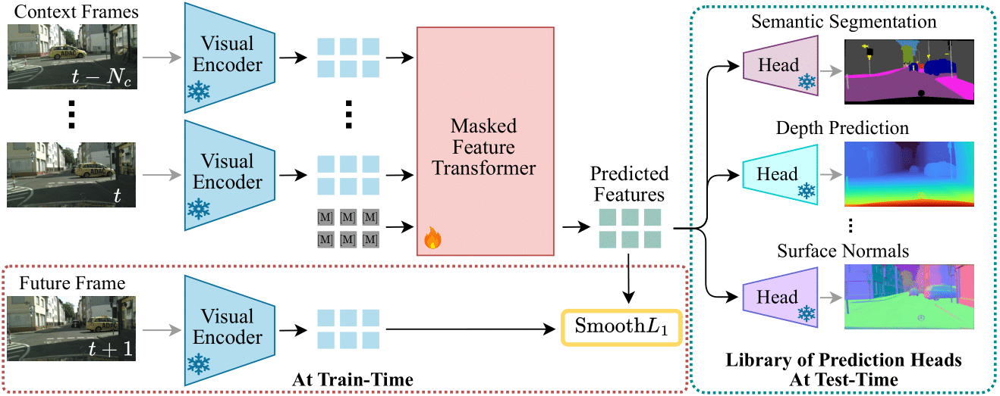

<div align="center">
<h1>DINO-Foresight: Looking into the Future with DINO</h1>

**Efstathios Karypidis<sup>1,3</sup>, Ioannis Kakogeorgiou<sup>1</sup>, Spyros Gidaris<sup>2</sup>, Nikos Komodakis<sup>1,4,5</sup>**

<sup>1</sup>Archimedes/Athena RC <sup>2</sup>valeo.ai  
<sup>3</sup>National Technical University of Athens  <sup>4</sup>University of Crete   <sup>5</sup>IACM-Forth

[](https://arxiv.org/abs/2412.11673)
[](https://colab.research.google.com/drive/1K8o3-zkR5lCdAv7Qjz7rhWP8n2VrFOdz?usp=drive_link)
[](https://opensource.org/licenses/MIT)
[](https://huggingface.co/Sta8is/DINO-Foresight)
[](https://dino-foresight.github.io/)
[](https://huggingface.co/papers/2412.11673)


</div>



<br>

This repository contains the official implementation of the paper: **DINO-Foresight: Looking into the Future with DINO**

# Contents
1. [News](#news)
2. [Installation](#installation)
3. [Dataset Preparation](#dataset-preparation)
4. [Precompute PCA](#precompute-pca)
5. [Dino-Foresight Training](#dino-foresight-training)
6. [Downstream Tasks](#downstream-tasks)
7. [Evaluation](#evaluation)
8. [Demo](#demo)
9. [Citation](#citation)
10. [Acknowledgements](#acknowledgements)

# News
- **2025/9/19**: Dino-Foresight is accepted at NeurIPS 2025! 🎉 Stay tuned for more updates
- **2024-12-17**: [Arxiv Preprint](https://arxiv.org/abs/2412.11673) and GitHub repository are released!

# Installation
The code is tested with Python 3.11 and PyTorch 2.0.1+cu121 on Ubuntu 22.04.05 LTS.
Create a new conda environment:
```bash
conda create -n dinof python=3.11
conda activate dinof
```

Clone the repository and install the required packages:
```bash
pip install torch==2.2.0 torchvision==0.17.0 torchaudio==2.2.0 --index-url https://download.pytorch.org/whl/cu121   
git clone https://github.com/Sta8is/DINO-Foresight
cd DINO-Foresight
pip install -r requirements.txt
```

# Dataset Preparation
We use Cityscapes dataset for our experiments. Especially, we use the `leftImg8bit_sequence_trainvaltest` to train Dino-Foresight feature prediction model. You can download the sequence dataset from the [official website](https://www.cityscapes-dataset.com/). 
```
cityscapes
│
├───leftImg8bit_sequence
│   ├───train
│   ├───val
│   ├───test
```
## Prepare Labels for Library of Heads
For semantic/instance segmentation, we use the `leftImg8bit` and `gtFine` packages. To create targets for depth and surface normals we use off the shelf networks.
For more details regarding segmentation, depth and surface normals modalities preparation, refer to [Preparation of Labels for Library of Heads](preprocess_scripts/README.md).


# Precompute-PCA
To precompute the PCA matrices different Vision Foundation Models (VFMs) on cityscapes `leftImg8bit` (2975 images for train) use the [pca.py](pca.py) script. For example in order to precompute pca with 1152 components for DinoV2 features extracted from layers 3,6,9,12 using image size 448x896 run the following command:
```bash
python pca --feature_extractor dinov2 --layers 2,5,9,11 --image_size 448,896 --n_components 1152 --cityscapes_root /path/to/cityscapes/leftImg8bit
```
However, the implementation is based on scikit-learn (cpu-based) and may require a lot of RAM memory and time to compute the PCA matrices for features extracted from training set. For this reason, we provide the precomputed PCA checkpoints [here](https://huggingface.co/Sta8is/DINO-Foresight/blob/main/dinov2_pca_448_l%5B2_5_8_11%5D_1152.pth). To download the precomputed PCA via command line:
```bash
wget https://huggingface.co/Sta8is/DINO-Foresight/resolve/main/dinov2_pca_448_l%5B2_5_8_11%5D_1152.pth
```

# Dino-Foresight Training
The training of Dino-Foresight is divided into two stages. In the first stage, we train the model at low resolution (224x448) and in the second stage we fine-tune the model at high resolution (448x896).

## Stage 1: Train at low resolution 224x448
To train Dino-Foresight at low resolution 224x448 using default hyperparameters run the following command:
```bash
python train.py --num_workers=16 --num_workers_val=4 --num_gpus=8 --precision 16-mixed --eval_freq 10 --batch_size 8 --hidden_dim 1152 --heads 8 --layers 12 --dropout 0.1  --max_epochs 800 \
    --eval_mode_during_training --evaluate --single_step_sample_train --lr_base 8e-5 --loss_type SmoothL1 --masking "simple_replace" --seperable_attention --random_horizontal_flip \
    --random_crop --use_fc_bias --data_path="/path/to/cityscapes/leftImg8bit_sequence"  --sequence_length 5 --dinov2_variant "vitb14_reg" --d_layers 2,5,8,11  --train_mask_mode "full_mask" \
    --pca_ckpt "/path/to/pca_448_l[2_5_8_11]_1152.pth" \
    --dst_path /logdir/dino_foresight_lowres_pca_fullmask \

```
You can also download the pre-trained model from [here](https://huggingface.co/Sta8is/DINO-Foresight/blob/main/dinof_lowres.ckpt). To download the pre-trained model via command line:
```bash
wget https://huggingface.co/Sta8is/DINO-Foresight/resolve/main/dinof_lowres.ckpt
```


## Stage 2: 
To fine-tune Dino-Foresight at high resolution 448x896 using default hyperparameters run the following command:
```bash
python train.py --num_workers=16 --num_workers_val=4 --num_gpus=8 --precision 16-mixed --eval_freq 10 --batch_size 1 --hidden_dim 1152 --heads 8 --layers 12 --dropout 0.1  --max_epochs 20 \
    --eval_mode_during_training --evaluate --single_step_sample_train --lr_base 1e-5 --loss_type SmoothL1 --masking "simple_replace" --seperable_attention --random_horizontal_flip --accum_iter 8 \
    --random_crop --use_fc_bias --data_path="/home/ubuntu/cityscapes/leftImg8bit_sequence"  --sequence_length 5 --dinov2_variant "vitb14_reg" --d_layers 2,5,8,11  --img_size 448,896  --train_mask_mode "full_mask"  \
    --pca_ckpt /home/ubuntu/DinoFeatPred/pca/pca_448_l[2_5_8_11]_1152.pth \
    --dst_path /logdir/dino_foresight_highres_pca_fullmask \
    --ckpt /path/to/lowres/ckpt.pth --high_res_adapt
```
You can also download the pre-trained model from [here](https://huggingface.co/Sta8is/DINO-Foresight/blob/main/dinof_highres.ckpt). To download the pre-trained model via command line:
```bash
wget https://huggingface.co/Sta8is/DINO-Foresight/resolve/main/dinof_highres.ckpt
```

# Downstream Tasks
We provide the scripts to train and and evaluate a [DPT-head](https://github.com/isl-org/DPT) (our implementation is mostly based to [DPT of DepthAnything](https://github.com/LiheYoung/Depth-Anything/tree/main/depth_anything)) on the downstream tasks of semantic segmentation, depth estimation and surface normal estimation. For more details about the library of  DPT-heads, refer to [Downstream Tasks](Downstream/README.md).

# Evaluation
To evaluate feature prediction on downstream tasks, run the following commands:
## Semantic Segmentation
```bash
python train.py --num_workers=16 --num_workers_val=4 --num_gpus=8 --precision 16-mixed --eval_freq 10 \
    --batch_size 2 --hidden_dim 1152 --heads 8 --layers 12 --dropout 0.1  --max_epochs 20 \
    --eval_mode_during_training --evaluate --single_step_sample_train --lr_base 1e-5 --loss_type SmoothL1 \
    --masking "simple_replace" --seperable_attention --random_horizontal_flip --accum_iter 8 \
    --random_crop --use_fc_bias --data_path="/path/to/cityscapes/leftImg8bit_sequence"  --sequence_length 5 \
    --dinov2_variant "vitb14_reg" --d_layers 2,5,8,11  --img_size 448,896  --train_mask_mode "full_mask"  \
    --pca_ckpt /path/to/dinov2_pca_448_l[2_5_8_11]_1152.pth \
    --dst_path /home/ubuntu/logdir/dino_foresight_highres_pca_fullmask \
    --ckpt /path/to/dinof_highres.ckpt --eval_ckpt_only \
    --dpt_out_channels 128,256,512,512 --use_bn --nfeats 256 \
    --head_ckpt /path/to/head_segm_pca1152.ckpt --eval_modality "segm" --num_classes 19 \
```
## Depth Estimation
```bash
python train.py --num_workers=16 --num_workers_val=4 --num_gpus=8 --precision 16-mixed --eval_freq 10 \
    --batch_size 2 --hidden_dim 1152 --heads 8 --layers 12 --dropout 0.1  --max_epochs 20 \
    --eval_mode_during_training --evaluate --single_step_sample_train --lr_base 1e-5 --loss_type SmoothL1 \
    --masking "simple_replace" --seperable_attention --random_horizontal_flip --accum_iter 8 \
    --random_crop --use_fc_bias --data_path="/path/to/cityscapes/leftImg8bit_sequence"  --sequence_length 5 \
    --dinov2_variant "vitb14_reg" --d_layers 2,5,8,11  --img_size 448,896  --train_mask_mode "full_mask"  \
    --pca_ckpt /path/to/dinov2_pca_448_l[2_5_8_11]_1152.pth \
    --dst_path /home/ubuntu/logdir/dino_foresight_highres_pca_fullmask \
    --ckpt /path/to/dinof_highres.ckpt --eval_ckpt_only \
    --dpt_out_channels 128,256,512,512 --use_bn --nfeats 256 \
    --head_ckpt /path/to/head_depth_pca1152.ckpt --eval_modality "depth" --num_classes 256 \
```
## Surface Normal Estimation
```bash
python train.py --num_workers=16 --num_workers_val=4 --num_gpus=8 --precision 16-mixed --eval_freq 10 \
    --batch_size 2 --hidden_dim 1152 --heads 8 --layers 12 --dropout 0.1  --max_epochs 20 \
    --eval_mode_during_training --evaluate --single_step_sample_train --lr_base 1e-5 --loss_type SmoothL1 \
    --masking "simple_replace" --seperable_attention --random_horizontal_flip --accum_iter 8 \
    --random_crop --use_fc_bias --data_path="/path/to/cityscapes/leftImg8bit_sequence"  --sequence_length 5 \
    --dinov2_variant "vitb14_reg" --d_layers 2,5,8,11  --img_size 448,896  --train_mask_mode "full_mask"  \
    --pca_ckpt /path/to/dinov2_pca_448_l[2_5_8_11]_1152.pth \
    --dst_path /home/ubuntu/logdir/dino_foresight_highres_pca_fullmask \
    --ckpt /path/to/dinof_highres.ckpt --eval_ckpt_only \
    --dpt_out_channels 128,256,512,512 --use_bn --nfeats 256 \
    --head_ckpt /path/to/head_normals_pca1152.ckpt --eval_modality "surface_normals" --num_classes 3 \
```

# Demo
We provide 2 quick demos. 

- [](https://colab.research.google.com/drive/1K8o3-zkR5lCdAv7Qjz7rhWP8n2VrFOdz?usp=drive_link)
- [Demo](demo.ipynb).
# Citation
If you found DINO-Foresight useful in your research, please consider starring ⭐ us on GitHub and citing 📚 us in your research!
```bibtex
@inproceedings{karypidis2025dinoforesight,
title={{DINO}-Foresight: Looking into the Future with {DINO}},
author={Efstathios Karypidis and Ioannis Kakogeorgiou and Spyros Gidaris and Nikos Komodakis},
booktitle={The Thirty-ninth Annual Conference on Neural Information Processing Systems},
year={2025},
url={https://openreview.net/forum?id=gimtybo07H}
}
```

# Acknowledgements
Our code is partially based on [Maskgit-pytorch](https://github.com/valeoai/Maskgit-pytorch), a pytorch implementation of MaskedGit by ValeoAI. We also thank authors of [DINOv2](https://github.com/facebookresearch/dinov2), [DPT](https://github.com/isl-org/DPT), [DepthAnythingV2](https://github.com/DepthAnything/Depth-Anything-V2), [LOTUS](https://github.com/EnVision-Research/Lotus) for their work and open-source code.
